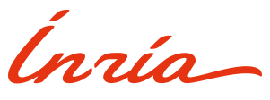
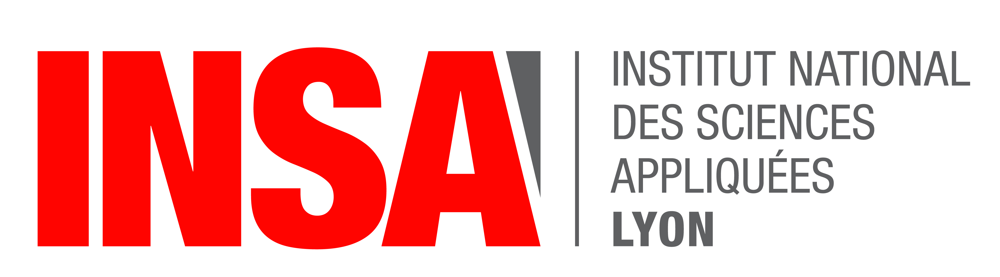
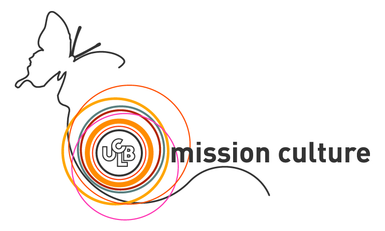
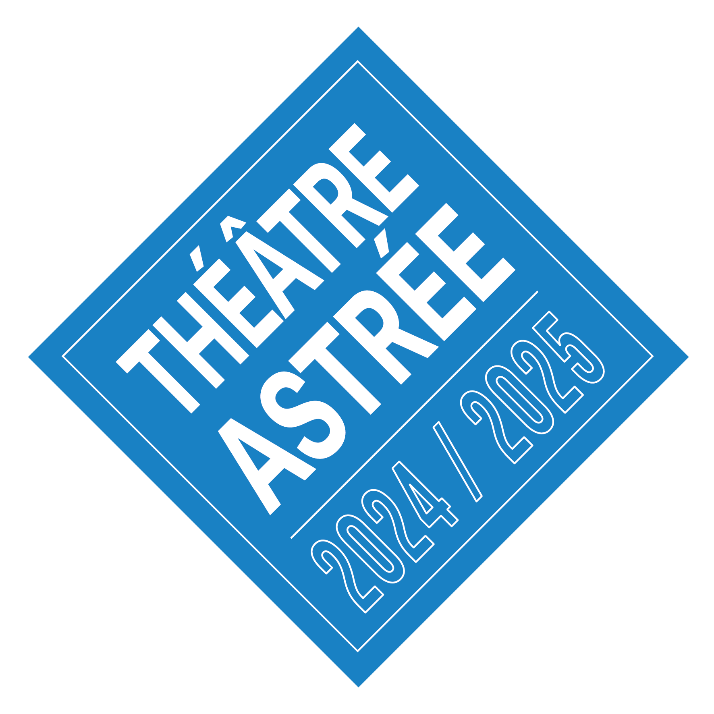

# JIMLAC 2025 - June 23-28, 2025 - Lyon (FR)

<!---->

* **Journées de l'Informatique Musicale (JIM): 23-25 juin 2025**
* **Linux Audio Conference (LAC): June 25-28, 2025**

In 2025, the Journées de l'Informatique Musicale and Linux Audio Conference join forces and will take place in Lyon (France) under the auspices of [Inria](https://inria.fr/), [GRAME-CNCM](https://grame.fr), [INSA Lyon](https://www.insa-lyon.fr/), and [AFIM](http://www.afim-asso.org/) as two successive events with shared ressources! You should expect many concerts, cool talks, fun social events, and great food! The final detailed program will soon be announced. In the meantime, you should feel free to [register to this event](register.md) and to [prepare your trip to Lyon](travel.md).

<!---->

 

## Program Overview

<table class="waffle" cellspacing="0" cellpadding="0" style="font-size:11pt;text-align:center;">
        <tbody>
            <tr style="font-size:13pt;">
                <td class="s0"></td>
                <td class="s1" dir="ltr"><b>June 23</b></td>
                <td class="s1" dir="ltr"><b>June 24</b></td>
                <td class="s1" dir="ltr" colspan="2"><b>June 25</b></td>
                <td class="s1" dir="ltr"><b>June 26</b></td>
                <td class="s1" dir="ltr"><b>June 27</b></td>
                <td class="s1" dir="ltr"><b>June 28</b></td>
            </tr>
            <tr>
                <td class="s1" dir="ltr">Morning</td>
                <td class="s0" dir="ltr">
                    
                        <b>JIM Paper Sessions</b> -- 
                    
                    Marie Curie Library
                </td>
                <td class="s2" dir="ltr">
                    <b>JIM Paper Sessions</b> -- 
                    Marie Curie Library
                </td>
                <td class="s0" dir="ltr" colspan="2">
                    
                        <b>JIM + ICCARE Joint Sessions</b> -- 
                    
                    Marie Curie Library
                </td>
                <td class="s0" dir="ltr">
                    
                        <b>LAC Paper Sessions</b> -- 
                    
                    Marie Curie Library
                </td>
                <td class="s0" dir="ltr">
                    
                        <b>LAC Paper Sessions</b> -- 
                    
                    Marie Curie Library
                </td>
                <td class="s0" dir="ltr">
                    
                        <b>LAC Paper Sessions</b> -- 
                    
                    Marie Curie Library
                </td>
            </tr>
            <tr>
                <td class="s1" dir="ltr">Afternoon</td>
                <td class="s2" dir="ltr">
                    <b>JIM Paper Sessions</b> -- 
                    Marie Curie Library
                </td>
                <td class="s0" dir="ltr">
                    
                        <b>JIM Paper Sessions</b> -- 
                    
                    Marie Curie Library
                </td>
                <td class="s0" dir="ltr">
                    
                        <b>JIM Paper Sessions</b> -- 
                    
                    Marie Curie Library
                </td>
                <td class="s0" dir="ltr">
                    
                        <b>ICCARE Sessions</b> -- 
                    
                    Marie Curie Library
                </td>
                <td class="s0" dir="ltr">
                    
                        <b>LAC Paper Sessions</b> -- 
                    
                    Marie Curie Library
                </td>
                <td class="s0" dir="ltr">
                    
                        <b>LAC Paper Sessions</b> -- 
                    
                    Marie Curie Library
                </td>
                <td class="s0" dir="ltr">
                    
                        <b>LAC Paper Sessions</b> -- 
                    
                    Marie Curie Library
                </td>
            </tr>
            <tr>
                <td class="s1" dir="ltr">Evening</td>
                <td class="s2" dir="ltr">
                    <b>Concert 1: GNOMON Premiere</b> -- 
                    Astrée Theater
                </td>
                <td class="s0" dir="ltr">
                    
                        <b>Concert 2: Folia</b> -- 
                    
                    Astrée Theater
                </td>
                <td class="s0" dir="ltr" colspan="2">
                    
                        <b>JIM + ICCARE + LAC Banquet With Live Electronic Music (Concert 3)</b> -- 
                    
                    CITI Lab Yard
                </td>
                <td class="s0" dir="ltr">
                    
                        <b>Concert 4: LAC Concert</b> -- 
                    
                    Astrée Theater
                </td>
                <td class="s0" dir="ltr">
                    
                        <b>Concert 5: LAC Concert</b> -- 
                    
                    Astrée Theater
                </td>
                <td class="s0" dir="ltr">
                    
                        <b>Concert 6: Live Electronic Music</b> -- 
                    
                    Le Sucre
                </td>
            </tr>
        </tbody>
    </table>

## How Will It Work?

* All you need to know about the Journées de l'Informatique Musicale 2025 can be found on the [JIM page of the website (in French)](jim.md).
* All you need to know about the Linux Audio Conference 2025 can be found on the [LAC page of the website](lac.md).

JIM 2025 and LAC 2025 remain two independent events with their own call for works, proceedings, committees, rules, etc. but they will be hosted in the same venues, will share some social events as well as the same registration system.

The scientific portion of both conferences will take place at the Marie Curie Library of INSA Lyon: <https://maps.app.goo.gl/RZj75WC7PqSbj5bDA>

The artistic portion of both conference will take place at the Théâtre Astrée of Lyon 1 University: <https://maps.app.goo.gl/w6fFaHR4NSP6rXXo6>

JIM concerts will take place on June 23 and 24. LAC concerts will take place on June 25-27 with potentially a "special" live coding concert on the 28th. JIM and LAC will have a joint banquet on June 25th which will serve both as a closing event for the JIM and a welcoming event for LAC.

## Contact

Feel free to reach out to us at [jimlac25_AT_grame_DOT_fr](mailto:jimlac25@grame.fr) if you have any questions.
