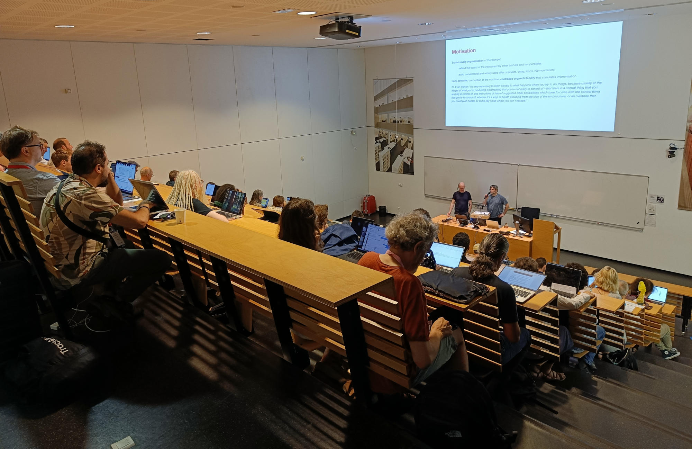
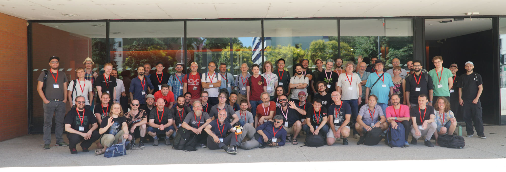
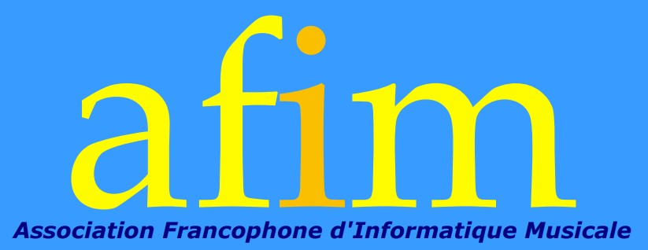
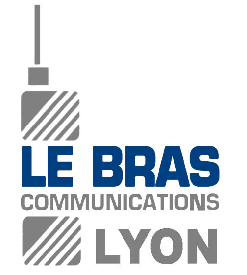
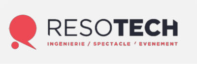

# JIMLAC 2025 - June 23-28, 2025 - Lyon (FR)

<!---->

In 2025, the Journées de l'Informatique Musicale and Linux Audio Conference joined forces and took place in Lyon (France) under the auspices of [Inria](https://inria.fr/), [GRAME-CNCM](https://grame.fr), [INSA Lyon](https://www.insa-lyon.fr/), and [AFIM](http://www.afim-asso.org/) as two successive events with shared ressources! It combined concerts, talks, social events, etc. The program of JIMLAC-25 and its associated papers and video recordings of the talks can be found [here](program.md).

* **[Journées de l'Informatique Musicale (JIM)](jim.md): 23-25 juin 2025**
* **[Linux Audio Conference (LAC)](lac.md): June 25-28, 2025**

 
<b>JIM 2025</b>

 
<b>LAC 2025</b>

<!---->

 

 

<!--
## How Will It Work?

* All you need to know about the Journées de l'Informatique Musicale 2025 can be found on the [JIM page of the website (in French)](calls.md#journees-de-linformatique-musicale-2025).
* All you need to know about the Linux Audio Conference 2025 can be found on the [LAC page of the website](calls.md#linux-audio-conference-2025).

JIM 2025 and LAC 2025 remain two independent events with their own call for works, proceedings, committees, rules, etc. but they will be hosted in the same venues, will share some social events as well as the same registration system.

The scientific portion of both conferences will take place at the Marie Curie Library of INSA Lyon: <https://maps.app.goo.gl/RZj75WC7PqSbj5bDA>

The artistic portion of both conference will take place at the Théâtre Astrée of Lyon 1 University: <https://maps.app.goo.gl/w6fFaHR4NSP6rXXo6>

JIM concerts will take place on June 23 and 24. LAC concerts will take place on June 25-27 with potentially a "special" live coding concert on the 28th. JIM and LAC will have a joint banquet on June 25th which will serve both as a closing event for the JIM and a welcoming event for LAC.
-->

## Contact

Feel free to reach out to us at [jimlac25_AT_grame_DOT_fr](mailto:jimlac25@grame.fr) if you have any questions.
